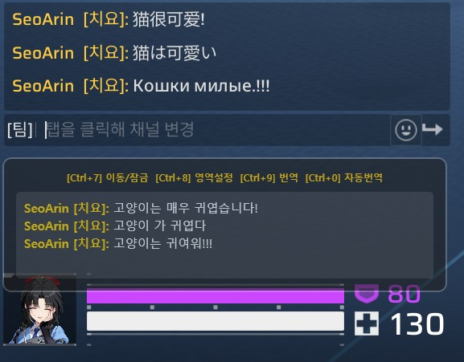

# 🎮 GameChatTranslator

**GameChatTranslator**는 게임 화면 속의 다양한 외국어를 실시간으로 인식하여 한국어로 번역해주는 윈도우용 오픈소스 도구입니다.

> **📢 알림 (Notice)**: 본 프로그램은 현재 **초기 개발 버전(Alpha)**입니다. 특정 상황에서 인식이 불안정할 수 있으며, 사용자 피드백을 바탕으로 빠르게 개선해 나갈 예정입니다.

> **📌 프로젝트 배경**: 아이드림스카이(iDreamSky)의 **스트리노바(Strinova)** 플레이 시 외국인 유저와의 원활한 소통을 위해 제작되었습니다. 

> **💡 개발 정보**: 전반적인 로직 설계 및 성능 최적화는 **OpenAI Codex**, **Anthropic Claude**, **Google Gemini Pro**의 협업을 통해 진행되었습니다.

---

## 📥 다운로드 (Download)

최신 버전의 실행 파일을 아래 링크에서 다운로드하세요!

[**👉 GameChatTranslator v1.0.8-alpha 다운로드 받기**](https://github.com/SeoArin9142/GameChatTranslator/releases/download/v.1.0.8-alpha/GameChatTranslator_v1.0.8-alpha.zip)

---

## ⚠️ 작동 조건 및 제한 사항 (중요)

정확한 번역을 위해 본 프로그램은 아래 조건에서만 동작합니다.

1. **채팅 형식 제한**: 오직 게임 내 `[캐릭터이름]: 채팅내용` 형식만 번역합니다. (대기실 채팅 번역X -> 자체번역기능있으니 그거 이용 바람) 
   - 시스템 메시지 및 귓속말은 번역 오염 방지를 위해 제외됩니다.
2. **언어 설정**: 현재는 **게임 내 언어 설정이 '한국어'일 때**만 정상 작동합니다.
   - 캐릭터 이름이 **한글**로 표시되는 환경(한국어 클라이언트)에 최적화되어 있습니다.
3. **환경**: 스트리노바의 채팅 레이아웃과 폰트에 최적화되어 있습니다.

---

## ✨ 주요 기능 (Features)

- **실시간 OCR 번역**: Windows OCR 엔진을 사용한 빠른 텍스트 추출.
- **OCR 전처리 모드 선택**: 빠름/자동/정확 모드로 OCR 처리 속도와 인식률을 상황에 맞게 전환.
- **OCR 성능 진단 로그**: 캡처, 전처리, OCR, 번역 API 단계별 처리 시간을 세션 로그에 기록.
- **OCR 테스트/진단 화면**: 현재 캡처 영역의 원본, 전처리 후보, OCR 결과, 후보 점수를 별도 창에서 비교.
- **실시간 로그창**: 별도 창에서 세션 로그와 CPU/메모리 사용량을 실시간으로 확인하고 보조 모니터에 배치 가능.
- **OCR 평균 성능 표시**: 로그창 상단에서 빠름/자동/정확 모드별 평균 처리 시간을 확인.
- **다국어 지원**: 영어, 일본어, 중국어, 러시아어 등 지원.
- **OCR 언어팩 상태 확인**: 환경설정창에서 Windows OCR 언어팩 설치 여부를 바로 확인.
- **자동 번역 모드**: 설정된 간격으로 자동 스캔 및 업데이트.
- **업데이트 확인**: 실행 시 자동 확인하거나 환경설정창에서 GitHub 릴리즈 기준 최신 버전 확인.
- **번역 결과 복사**: 최근 번역 결과를 단축키로 클립보드에 복사.
- **번역 결과 표시 방식 선택**: 최신 결과만 표시하거나 최근 N줄을 누적 표시하도록 선택.
- **사용자 커스텀**: `config.ini`를 통한 불투명도, 단축키 변경 기능.
- **설정 프리셋**: 언어, 단축키, OCR, 캡처 영역 설정을 이름별로 저장/불러오기.
- **설정 백업/복원**: `config.ini`를 내보내거나 가져와 다른 PC와 설정/프리셋을 이동.
- **자동 배치**: 스트리노바 채팅창 위치(좌측 하단) 자동 정렬 및 영역 설정.

---

## 🛠️ 시작하기 전 필수 설정

1. **`LangInstall.bat`** 파일을 **관리자 권한으로 실행**하여 필요한 OCR 언어팩만 선택 설치하세요.
   - 선택 가능: 영어(en-US), 일본어(ja-JP), 중국어 간체(zh-CN), 러시아어(ru-RU)
2. 설치 후 반드시 **컴퓨터 재부팅**이 필요합니다.
3. 프로그램 실행 시 **관리자 권한 요청(UAC)**이 표시됩니다. 승인해야 모든 기능이 정상 작동합니다.

---

## ⌨️ 기본 단축키 (Hotkeys)

| 기능 | 단축키 | 설명 |
|:---|:---|:---|
| **이동/잠금** | `Ctrl + 7` | 테두리가 녹색일 때 드래그 가능 |
| **영역 설정** | `Ctrl + 8` | 번역할 채팅창 범위를 드래그로 지정 |
| **수동 번역** | `Ctrl + 9` | 1회 즉시 번역 |
| **번역 복사** | `Ctrl + 6` | 최근 번역 결과를 클립보드에 복사 |
| **로그창 ON/OFF** | `Ctrl + =` | 현재 세션 로그를 별도 창으로 표시/숨김 |
| **자동 번역 모드** | `Ctrl + 0` | 빠름 → 자동 → 정확 → OFF 순환 |
| **모드 변경** | `Ctrl + -` | 제미나이/구글 번역 모드 변경 |

---

### 자동 번역 OCR 모드

`Ctrl + 0`을 누를 때마다 자동 번역 모드가 아래 순서로 변경됩니다. 현재 모드는 번역창 상단 안내 문구에 표시됩니다.

| 모드 | 동작 |
|:---|:---|
| **빠름** | 기본 색상 필터와 게임 언어 OCR만 사용합니다. 정상 채팅 포맷과 캐릭터명이 확인될 때만 즉시 번역합니다. |
| **자동** | 빠름 모드로 먼저 시도하고, 실패할 때만 글자 굵기 보정/적응형 이진화 후보를 추가 비교합니다. |
| **정확** | 모든 전처리 후보와 OCR 언어 결과를 비교합니다. 가장 느리지만 배경 노이즈가 심한 장면에 유리합니다. |
| **OFF** | 자동 번역을 중지합니다. |

---

## ⚙️ 설정 파일 (config.ini)

- `Opacity`: 번역창의 투명도를 조절합니다. (0: 투명 ~ 100: 불투명)
- `AutoTranslateInterval`: 자동 번역 모드 시 캡처 주기를 설정합니다. (초 단위)
- `Threshold`: 폰트 인식 임계값입니다. 투명 배경 방어 로직 적용 후 110~130 사이를 권장합니다.
- `ScaleFactor`: 캡처 이미지 확대 배율입니다. 3 배 이상일 때 한자 및 일본어 인식률이 가장 좋습니다.
- `GeminiKey`: Gemini API 키입니다. 설정창에서 직접 입력할 수 있으며 `[Settings]` 섹션에 저장합니다.
- `GeminiModel`: Gemini 호출 모델입니다. 설정창에서 직접 입력할 수 있으며 기본값은 `gemini-2.5-flash`입니다.
- `SaveDebugImages`: 디버그용 캡처 이미지를 저장할지 설정합니다. 기본값은 `false`입니다.
- 자동/수동 번역을 실행하면 `logs` 폴더에 `[OCR PERF]` 항목이 기록되며, OCR 지연 원인 분석에 사용할 수 있습니다.
- 환경설정창의 **OCR 진단 화면 열기** 버튼으로 원본 캡처, Color/ColorThick/Adaptive 전처리 이미지, 언어별 OCR 결과, 후보 점수를 즉시 확인할 수 있습니다.
- `ResultDisplayMode`: 번역 결과 표시 방식입니다. `Latest`는 최신 결과만 표시하고, `History`는 최근 내역을 누적 표시합니다.
- `ResultHistoryLimit`: `History` 모드에서 유지할 최대 번역 줄 수입니다. 기본값은 30입니다.
- `CheckUpdatesOnStartup`: 실행 시 업데이트 자동 확인 여부입니다. `false`면 환경설정창의 업데이트 버튼으로만 확인합니다.
- `Key_CopyResult`: 최근 번역 결과 복사 단축키입니다. 기본값은 `Ctrl+6`입니다.
- `Key_LogViewer`: 로그창 ON/OFF 단축키입니다. 기본값은 `Ctrl+=`입니다.
- 단축키 설정창의 **단축키 초기화** 버튼은 입력칸만 기본값으로 되돌리며, 저장 버튼을 눌러야 config.ini에 반영됩니다.
- `[Presets]`: 설정창의 프리셋 저장 기능에서 사용하는 프리셋 이름 목록입니다.
- 환경설정창의 **설정 내보내기 / 설정 가져오기** 버튼으로 `config.ini` 전체를 백업/복원할 수 있습니다. 가져오기 전 기존 설정은 자동 백업됩니다.
---

## 👨‍💻 기여 및 문의

본 프로젝트는 **OpenAI Codex**, **Anthropic Claude**, **Google Gemini Pro**가 함께 만들어가는 초기 단계 프로젝트입니다. 스트리노바 유저분들의 소중한 피드백은 **Issues** 탭에 남겨주시면 개발에 큰 힘이 됩니다!

## 업데이트 내역 (v.1.0.8-alpha)

   이번 버전에서는 자동 번역 병목 분석, 실시간 로그 확인, OCR 언어팩 설치 상태 확인, 릴리즈 자동화를 중심으로 운영 편의 기능을 강화했습니다.

   📊 OCR 성능 진단 로그

      자동/수동 번역 실행 시 `[OCR PERF]` 로그를 남기도록 추가했습니다.

      Capture, Resize, Preprocess, Crop, OCR, Scoring, Translate, Total 시간을 단계별로 기록해 병목 위치를 확인할 수 있습니다.

      선택된 전처리 후보, OCR 호출 수, 번역/스킵 라인 수도 함께 기록합니다.

   🪟 실시간 로그창

      `Ctrl + =` 단축키로 별도 로그창을 열고 숨길 수 있습니다.

      로그창은 일반 타이틀바와 크기 조절을 지원해 보조 모니터로 이동해 사용할 수 있습니다.

      `AppendLog()`에서 새 로그를 즉시 전달하므로 실시간으로 로그 변화를 확인할 수 있습니다.

      로그창 상단에 현재 GameChatTranslator 프로세스의 CPU와 메모리 사용량을 표시합니다.

   🌐 OCR 언어팩 상태 확인

      환경설정창에서 한국어, 영어, 중국어 간체, 일본어, 러시아어 OCR 언어팩 설치 상태를 확인할 수 있습니다.

      Windows OCR 엔진 생성 가능 여부를 기준으로 OK/NO 상태를 표시합니다.

      상태 새로고침 버튼을 통해 언어팩 설치 후 재확인할 수 있습니다.

   🚀 릴리즈 자동화

      GitHub Actions 기반 자동 릴리즈 빌드 workflow를 추가했습니다.

      태그 push 시 Release 빌드, win-x64 self-contained publish, zip 압축, SHA256 생성, 릴리즈 asset 업로드, Latest 지정까지 자동으로 진행됩니다.

지난 업데이트 내역

## 업데이트 내역 (v.1.0.7-alpha)

   이번 버전에서는 코드 이해도를 높이기 위한 상세 주석 보강, OCR 언어팩 선택 설치, 단축키 초기화 편의 기능을 추가했습니다.

   📝 소스 주석 및 문서 보강

      주요 함수 위에 역할, 파라미터, 반환값, 부작용을 설명하는 주석을 추가했습니다.

      캡처 -> 전처리 -> OCR -> 점수화 -> 번역 -> 출력으로 이어지는 핵심 흐름을 따라가기 쉽도록 내부 로직 설명을 보강했습니다.

      배포용 readme.txt에 실행 흐름, 단축키, OCR 모드, config.ini 주요 키, 문제 해결 항목을 더 자세히 정리했습니다.

   🌐 OCR 언어팩 선택 설치

      LangInstall.bat 실행 시 영어, 일본어, 중국어, 러시아어 중 필요한 OCR 언어팩만 선택 설치할 수 있도록 변경했습니다.

      영어(en-US) 설치 선택지를 추가했습니다.

      설치 전 선택한 언어 목록을 다시 확인하고, 관리자 권한 또는 설치 실패 가능성을 안내하도록 개선했습니다.

   ⌨️ 단축키 초기화

      환경설정창에 [단축키 초기화] 버튼을 추가했습니다.

      버튼을 누르면 UI 입력칸만 기본 단축키로 돌아가며, [저장 및 게임 시작]을 눌러야 config.ini에 실제 저장됩니다.

      프리셋 불러오기 시 누락된 단축키 값도 동일한 기본값을 사용하도록 정리했습니다.

## 업데이트 내역 (v.1.0.6-alpha)

   이번 버전에서는 투명한 채팅창 배경에서 OCR 인식률을 보완하고, 자동 번역 처리 속도를 상황별로 조절할 수 있도록 개선했습니다.

   🎯 OCR 전처리 개선

      기존 색상 필터 외에 글자 굵기 보정과 적응형 이진화 후보를 추가했습니다.

      채팅 포맷과 캐릭터명 일치 여부를 기준으로 OCR 후보를 점수화해 더 안정적인 결과를 선택합니다.

      디버그 이미지 저장 옵션이 켜져 있으면 전처리 후보별 이미지를 함께 저장해 인식 문제를 확인하기 쉽게 했습니다.

   ⚡ 자동 번역 속도 모드

      `Ctrl + 0` 자동 번역 단축키를 빠름 → 자동 → 정확 → OFF 순환 방식으로 변경했습니다.

      빠름 모드는 기본 색상 필터와 게임 언어 OCR만 사용해 처리 속도를 우선합니다.

      자동 모드는 빠른 경로가 실패할 때만 추가 전처리를 실행해 속도와 인식률을 함께 고려합니다.

      정확 모드는 모든 전처리 후보와 OCR 언어 결과를 비교해 배경 노이즈가 심한 장면에 대응합니다.

   🧩 빌드 정리

      고DPI 설정을 프로젝트 속성으로 정리해 빌드 경고를 제거했습니다.

## 업데이트 내역 (v.1.0.5)

   이번 버전에서는 게임 중 마우스 클릭 방해를 줄이고, 업데이트 확인 흐름과 설정창 구성을 개선했습니다.

   ⌨️ 복사 단축키 전환

      번역 오버레이의 복사 버튼을 제거하고, 최근 번역 결과를 `Ctrl + 6` 단축키로 복사하도록 변경했습니다.

      복사 단축키는 환경설정창에서 `Key_CopyResult` 값으로 변경할 수 있습니다.

   🔄 업데이트 확인 흐름 개선

      번역 오버레이에 있던 업데이트 확인 버튼을 환경설정창으로 이동했습니다.

      프로그램 실행 시 최신 릴리즈를 자동 확인하고, 새 버전이 있으면 릴리즈 페이지 이동 여부를 묻도록 했습니다.

      릴리즈 페이지로 이동하는 경우 업데이트 진행을 위해 프로그램이 자동 종료됩니다.

      "다시 묻지 않기"를 선택하면 시작 시 자동 업데이트 확인을 끄고, 이후에는 환경설정창의 업데이트 확인 버튼으로만 확인합니다.

   ⚙️ 환경설정창 정리

      업데이트 자동 확인 여부를 환경설정창에서 켜고 끌 수 있도록 했습니다.

      Gemini AI 번역 설정 영역을 환경설정창 가장 아래로 이동했습니다.

## 업데이트 내역 (v.1.0.4)

   이번 버전에서는 환경 설정 편의성, 업데이트 확인, 번역 결과 복사, 관리자 권한 실행 기본값을 중심으로 개선했습니다.

   ⚙️ 환경 설정 개선

      설정창에서 Gemini API Key와 Gemini Model을 직접 입력할 수 있도록 개선했습니다.

      환경설정창 기본 높이를 1000으로 확장하고, 내용이 더 길어질 경우 스크롤로 확인할 수 있도록 유지했습니다.

      언어, 단축키, OCR, 캡처 영역, 창 크기 설정을 이름별로 저장하고 불러올 수 있는 설정 프리셋 기능을 추가했습니다.

      프리셋에는 Gemini API Key를 저장하지 않아 API 키가 프리셋 변경으로 덮어써지지 않도록 했습니다.

   🧭 사용 편의 기능

      GitHub 릴리즈 기준 최신 버전을 확인하는 업데이트 확인 버튼을 추가했습니다.

      최근 번역 결과를 클립보드에 복사하는 버튼을 추가했습니다.

      업데이트 확인 버튼과 복사 버튼을 번역 오버레이 왼쪽으로 이동하여 게임 화면 방해를 줄였습니다.

   🔐 실행 권한

      프로그램 실행 시 관리자 권한을 기본 요청하도록 변경했습니다.

      단축키 등록과 화면 캡처 기능이 권한 부족으로 실패할 가능성을 줄였습니다.

## 업데이트 내역 (v.1.0.3-alpha)

   이번 버전에서는 알파 버전 안정화, 유지보수성 개선, DPI/멀티모니터 환경의 캡처 정확도 개선이 진행되었습니다.

   🛠️ 알파 안정화

      영역 선택 후 프로그램이 함께 종료되던 문제를 수정했습니다.

      config.ini 기본값 처리 방식을 정리하여 GeminiKey, GeminiModel 등 설정값이 안정적으로 적용되도록 개선했습니다.

      단축키 등록 실패 시 로그와 화면 경고가 표시되도록 보완했습니다.

      Google 번역 모드에서 OCR 후처리 로직이 실제로 적용되지 않던 문제를 수정했습니다.

   🧩 코드 구조 개선

      기존 MainWindow.xaml.cs에 몰려 있던 기능을 역할별 partial class 파일로 분리했습니다.

      Win32 API, 설정, 창 생명주기, 단축키, 캡처, 로그, OCR/번역 로직을 각각 별도 파일로 나누어 유지보수성을 높였습니다.

   🖥️ DPI 및 멀티모니터 캡처 개선

      WPF 표시 좌표와 BitBlt 물리 픽셀 좌표를 분리하여 고DPI 환경에서 캡처 영역이 어긋날 가능성을 줄였습니다.

      영역 선택 창을 VirtualScreen 기준으로 표시하여 보조 모니터에서도 영역 선택이 가능하도록 개선했습니다.

      캡처 좌표를 CapturePixelX/Y/W/H 값으로 저장하여 재실행 후에도 실제 픽셀 좌표를 유지합니다.

   🔁 재번역 캐시 개선

      Google/Gemini 엔진 전환 또는 캡처 영역 변경 시 이전 OCR 결과 캐시를 초기화하도록 수정했습니다.

      같은 채팅이라도 엔진 전환 후 다시 번역할 수 있습니다.

   📂 디버그 이미지 저장 옵션화

      디버그 캡처 이미지 저장을 기본 비활성화했습니다.

      설정창에 "디버그 캡처 이미지 저장" 옵션을 추가하여 문제 재현 시에만 Captures 폴더에 이미지를 저장할 수 있습니다.

## 업데이트 내역 (v.1.0.2-alpha)

   이번 버전에서는 고성능 게이밍 환경(360Hz 이상)에서의 프레임 방어와 투명한 채팅창 배경에서의 인식률 저하 문제를 해결하기 위한 딥 이미지 프로세싱 및 실시간 AI 엔진 스위칭 기능이 도입되었습니다.

   🚀 실시간 번역 엔진 스위칭 기능 도입

      [Ctrl + -] 단축키 추가: 번역 중 실시간으로 **Google(빠름)**과 Gemini(정확함) 엔진을 즉시 교체할 수 있습니다.
      
      평소에는 빠른 구글 엔진을 사용하다가, 문맥 파악이 중요한 상황에서만 단축키 하나로 제미나이의 고성능 AI 번역을 전략적으로 활용할 수 있습니다.

   🛡️ 절대 방어 '항상 위(Always on Top)' 강화

      Win32 API 하이재킹: 일반적인 윈도우 최상단 설정을 넘어, 2초 주기 '하트비트' 타이머가 창의 우선순위를 강제로 감시합니다.
      
      전체화면 모드나 격렬한 화면 전환이 발생하는 게임 환경에서도 번역창이 뒤로 밀리지 않고 게임 화면 위에 안정적으로 고정됩니다.

   🎯 투명 배경 & 이펙트 완벽 방어 (RGB 필터링)
      
      지능형 이진화 로직: 단순히 밝기로만 구분하던 방식에서 탈피하여, **순백색(채팅)**과 **순황색(닉네임)**의 색상 편차를 분석하는 전처리 로직을 도입했습니다.
      
      투명한 채팅창 뒤로 화려한 스킬 이펙트나 밝은 배경이 지나가더라도 글자만 깨끗하게 발라내어 인식률을 비약적으로 상승시켰습니다.

   ⚡ 게이머를 위한 프레임 최적화 (Async I/O)

      비동기 이미지 프로세싱: 캡처 및 디버깅 이미지 저장 작업을 메인 스레드에서 분리하여 백그라운드로 전송합니다.
      
      이미지 저장 시 발생하던 미세한 끊김(Stuttering)을 원천 차단하여 초고주사율 모니터 사용자도 프레임 드랍 없이 부드럽게 게임을 즐길 수 있습니다.

   📂 세션 기반 로그 및 리소스 관리
      
      타임스탬프 세션 로그: 실행할 때마다 별도의 로그 파일(yyyyMMdd_HHmm)을 생성하여 재시작 시 이전 기록과 섞이지 않도록 개선되었습니다.
      
      환경값 자동 기록: 실행 시 적용된 모든 환경 변수(Threshold, Scale 등)가 로그 상단에 기록되어 최적의 세팅값을 추적하기 용이합니다.
      
      30분 자동 클린업: 디버깅용 캡처 폴더가 무한정 커지지 않도록 항상 최근 30분 분량의 사진만 유지하여 하드디스크 용량을 보호합니다.

   🔒 보안 및 배포 최적화

      API 보안 패치: 소스 코드 내 하드코딩된 API 키를 제거하고, 유효성 검증 로직을 추가하여 개인정보 유출을 방지했습니다.
      
      단일 파일(Single EXE) 빌드: 그래픽 처리에 필요한 네이티브 DLL까지 실행 파일 하나에 압축 포함하여, 별도의 라이브러리 설치 없이 바로 실행이 가능합니다.

## 업데이트 내역 (v.1.0.1-alpha)

 이번 버전에서는 사용자 편의성 강화와 스트리노바(Strinova) 특유의 채팅 포맷 인식을 위한 로직 고도화가 진행되었습니다. 

  통합 설정창(Option Selector) 도입

    프로그램 실행 시 설정창이 먼저 팝업되어 언어, 투명도, 단축키를 한눈에 관리할 수 있습니다.
    단축키 설정 시 텍스트박스를 클릭하고 원하는 키를 누르면 자동으로 조합(Ctrl, Shift 등)이 입력됩니다.

  캡처 영역 시각화 가이드 추가
    
    [이동/잠금] 해제 상태(Ctrl + 7) 시, 현재 번역기가 감시 중인 영역이 화면에 붉은색 테두리로 표시되어 영역 수정이 훨씬 직관적입니다.
   
  스트리노바 맞춤형 지능형 라인 병합
    
    닉네임과 채팅 내용 사이의 넓은 공백 때문에 문장이 쪼개져 인식되던 버그를 해결했습니다.
    Y축 좌표 분석을 통해 파편화된 텍스트 조각을 한 줄의 문장으로 자동 병합합니다.

  인식률 및 번역 정확도 고도화

    3배 업스케일링: 캡처 이미지를 3배 확대 처리하여 작은 글씨 인식률을 극대화했습니다.
    다중 엔진 점수제: 일본어, 러시아어, 중국어 등 각 언어별 엔진 판독 결과를 비교 분석하여 가장 정확한 결과값을 선별합니다.
    스마트 번역 스킵: 인식된 결과가 이미 한국어이거나 번역이 필요 없는 특수문자인 경우, API 호출을 생략하여 출력 속도를 최적화했습니다.

  설정 자동 유지 (Persistence)

    마지막으로 설정한 번역창의 크기, 위치, 캡처 영역 좌표가 모두 저장되어 재실행 시 별도의 세팅 없이 바로 게임을 즐길 수 있습니다.

